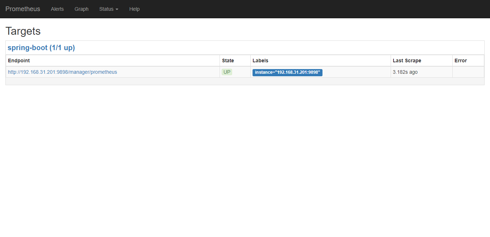
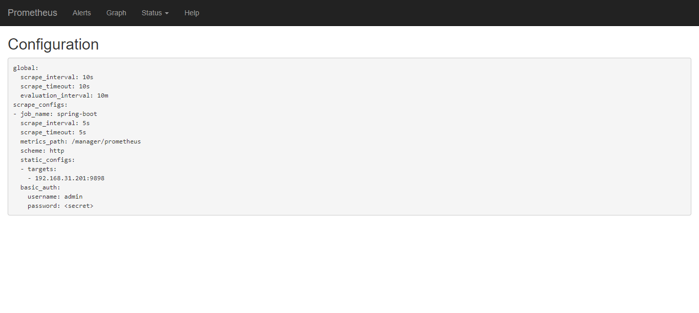
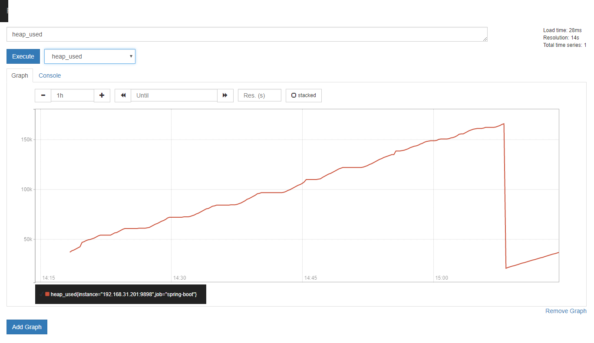
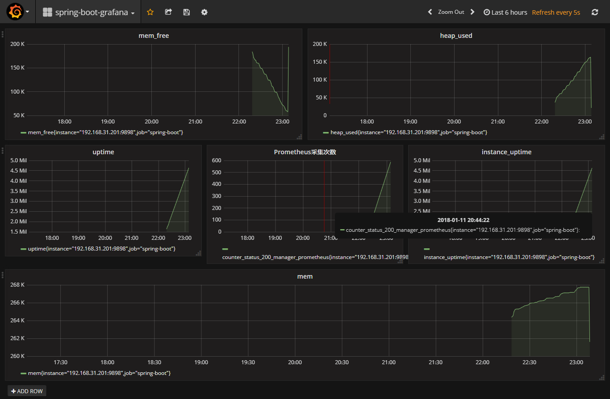

# spring-boot-prometheus-grafana-example

服务器监控和告警系统`Bosun`,`cAdvisor`,`Prometheus`

## 安装 Prometheus

获取 Prometheus 的 Docker 镜像：

```bash
$ docker pull prom/prometheus
```

编写 prometheus.yml 配置文件 

```yml
global:
  scrape_interval: 10s
  scrape_timeout: 10s
  evaluation_interval: 10m
scrape_configs:
  - job_name: spring-boot
    scrape_interval: 5s
    scrape_timeout: 5s
    metrics_path: /manager/prometheus
    scheme: http
    basic_auth:
      username: admin
      password: admin
    static_configs:
      - targets:
        - 192.168.31.201:9898  #此处填写 Spring Boot 应用的 IP + 端口号
```

启动 Prometheus

```bash
$ docker run -d \
--name prometheus \
-p 9090:9090 \
-m 500M \
-v "$(pwd)/prometheus.yml":/prometheus.yml \
-v "$(pwd)/data":/data \
prom/prometheus \
--config.file=/prometheus.yml \
--log.level=info
```

访问 http://192.168.31.216:9090/targets , 检查 Spring Boot 采集状态是否正常。





## Grafana 可视化监控数据

获取 Grafana 的 Docker 镜像

```bash
$ docker pull grafana/grafana
```

然后，启动 Grafana：

```bash
$ docker run --name grafana -d -p 3000:3000 grafana/grafana
```

接着，访问 http://localhost:3000/ 配置 Prometheus 数据源：

Grafana 登录账号 admin 密码 admin

然后在 Grafana 中配置各监控指标



## 参考文章

https://www.jianshu.com/p/7ecb57a3f326

http://qinghua.github.io/prometheus

https://prometheus.io/docs/prometheus/latest/installation/#using-docker

http://docs.grafana.org/installation/docker/

http://www.ywnds.com/?p=9668

http://www.ywnds.com/?cat=122

http://bosun.org/quickstart

http://blog.yiyun.pro